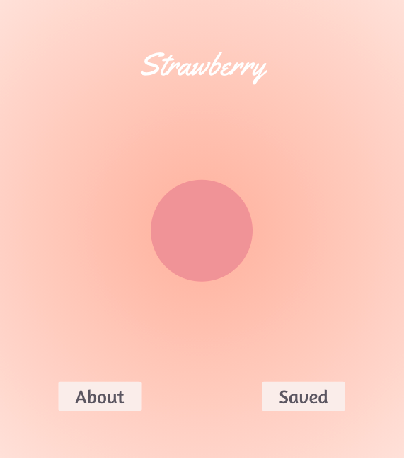
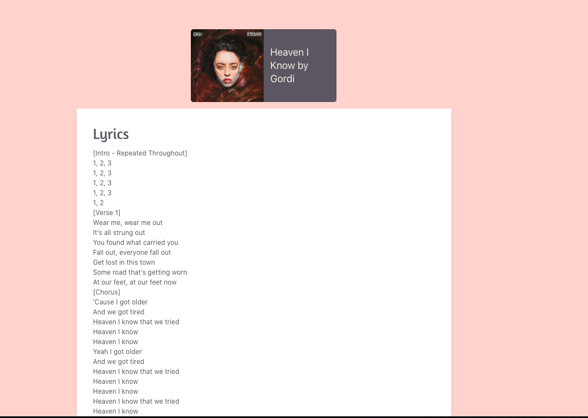
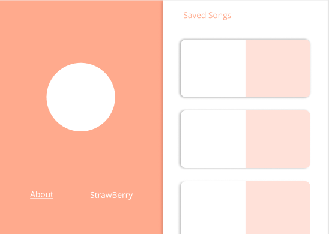
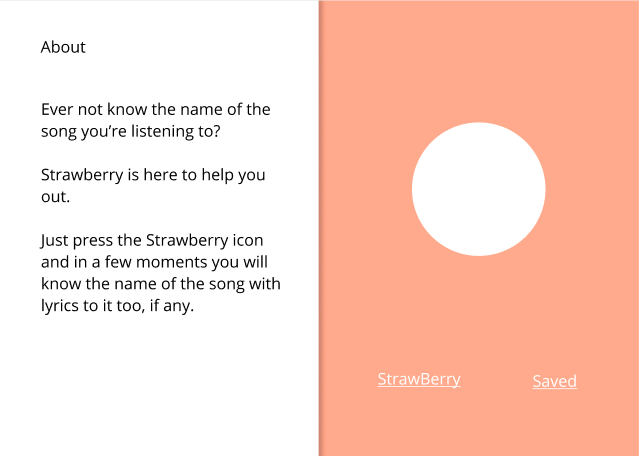
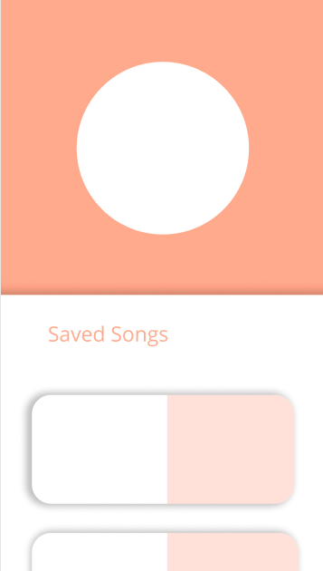

# [Strawberry🍓](https://strawberrysound.netlify.app/)

### Ever have trouble finding that song that's in your head? Well Music Speech lyric finder go is your solution

### Just use your voice to find the lyrics of the song you're thinking about and music speech lyric finder go will help you out

## Tech used

> - AudD API
> - React Spring
> - TailwindCSS

## What it does

   
 Strawberry is an Music Identifier Application. The app give users the
    ability to identify songs based on a small sample of songs Recorded to  the Strawberry application. This is done by using the microphone on the
    users device. Starwberry not only identifies tracks titles and authors, but it also finds lyrics and saves the tracks that the users searched for.

## The Build

> We built a wireframe layout using figma. We spent a week building the project using React and Redux to pass data throughout the components.

## Component Hierarchy 

